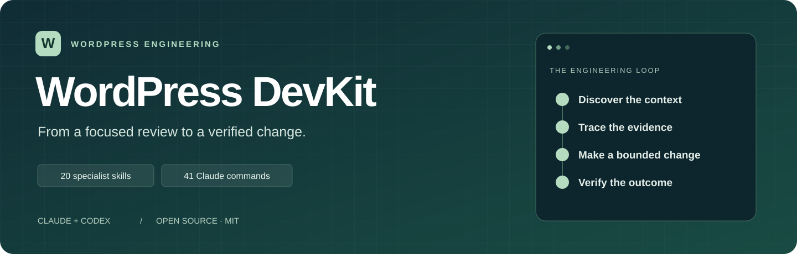

<p align="center">
  
</p>

# WordPress DevKit

**Evidence-based WordPress engineering skills for Claude Code, ChatGPT, Codex and Google Antigravity.**

[](https://github.com/ehsanenaloo/wordpress-devkit/actions/workflows/ci.yml)
[](LICENSE)
[](https://github.com/ehsanenaloo/wordpress-devkit/releases)


Ask your AI agent to review a plugin, trace a slow query, build a block, harden a REST route or prepare a release. DevKit gives it a practitioner's workflow for each job, the WordPress-specific references behind it, and a contract that keeps its answers honest: **no finding without a traced path, no pass without a check that actually ran.**

**[Quick start](docs/guides/quick-start.html)** · **[Installation](#installation)** · **[Skills](#skills)** · **[Commands](#commands)** · **[Guides](docs/guides/index.html)** · **[Contribute](.github/CONTRIBUTING.md)**

## Why DevKit

Generic prompts make agents confident and wrong about WordPress: they flag `$wpdb` calls that are already prepared, call a nonce an authorization check, miss that block checkout skips a classic hook, or declare a site "WCAG compliant" from a Lighthouse score. DevKit is built to prevent that.

- **Evidence before severity.** Every skill follows one engineering contract: trace actor, input, authorization and sink first. A search match is a lead, not a finding. Severity follows demonstrated impact.
- **Review and implementation stay separate.** Audits are read-only. Changes need an explicit request, a stated design and a regression check.
- **Guidance checked against primary sources.** Version-sensitive statements were verified against WordPress core, WooCommerce, PHP, PHPStan, W3C and other official sources. Each reference lists its sources and research date, and marks what could not be confirmed.
- **Honest reporting.** Results list what ran, with exit codes, and what did not. A tool that was not available is reported as unexecuted, never as a pass.
- **Built for real projects.** Multisite, HPOS, object caches, block and classic checkout, headless frontends, Action Scheduler jobs, large option and meta tables.
- **Tested like software.** Structure, installers, recovery, packaging and the doctor have automated tests, and a registry of more than 120 behavioural cases (real defects, benign look-alikes and insufficient-evidence situations) covers every skill.

## What a result looks like

```text
/wp-devkit:security-review wp-content/plugins/acme-notes

Scope: 14 PHP files, REST + AJAX entrypoints. Not executed: runtime requests, PHPStan (not installed).

CRITICAL  includes/rest.php:48   Wrong-owner write (confidence: high)
  Actor:     authenticated subscriber
  Path:      PUT /acme/v1/notes/(?P<id>\d+) -> permission_callback is_user_logged_in()
             -> update_post_meta( $request['id'], ... ) with no ownership check
  Impact:    any logged-in user can overwrite any note
  Fix:       authorize the object: current_user_can( 'edit_post', $id )
  Regression: owner 200, other subscriber 403, anonymous 401, stored value unchanged

CANDIDATE includes/cache.php:21  maybe_unserialize( get_option( 'acme_cache' ) )
  Missing evidence: who can write the 'acme_cache' option. No severity assigned.

Checked and fine: includes/search.php:33 (query is prepared with %d/%s; the grep hit is a false positive).
```

Illustrative output; real results depend on your project and the checks that can run.

## Installation

### Prerequisites

Use **Python 3.10+** for the installer and repository checks. Install your selected agent separately. Git is needed to clone the source. Additional tools depend on the target WordPress task.

```sh
git clone https://github.com/ehsanenaloo/wordpress-devkit.git
cd wordpress-devkit
python --version
```

Use `python3` where that is your interpreter command. Run the installation commands below from the DevKit checkout.

### Choose your agent path

| Mode | What you get | Activation |
|---|---|---|
| Claude plugin | Skills plus `/wp-devkit:` commands | Load the checkout through the supported plugin flow |
| Claude manual skills | Complete canonical workflows and references | Request the installed skill by name or in natural language |
| Codex manual skills | Complete canonical workflows and references | Select the installed skill or use its explicit selector |
| Antigravity plugin or manual skills | Complete workflows with native Google packaging | Select a discovered skill by name |

**Claude plugin session**

For a Claude Code CLI that supports local plugins, replace the path with your checkout:

```powershell
claude --plugin-dir "C:\path\to\wordpress-devkit"
```

This loads the plugin for your current CLI session. After starting it, check that the commands appear. Cloning the repository gives you the files; you still need to load them in Claude. Desktop setup may differ.

**ChatGPT and Codex plugin package**

The root `plugin.json` follows the portable format in [OpenAI plugin documentation](https://developers.openai.com/plugins/build/plugins). It discovers the self-contained `skills/` tree. The Claude manifest remains in `.claude-plugin/plugin.json`. Both packages share one identity and prepared version.

The included `.agents/plugins/marketplace.json` exposes **WordPress DevKit** as an available plugin. Its `./` source resolves to the package root, where `plugin.json` and all 20 complete skills live. Extract the archive before using it; point the client at the extracted `wp-devkit` folder.

**ChatGPT desktop (Work mode or Codex)**

Open the extracted package folder as your project, then restart the desktop app. Open **Plugins Directory**, choose **WordPress DevKit**, and install **wp-devkit**. Start a new chat and select a matching skill. This local setup requires a client with plugin support; it does not register a plugin in ChatGPT web or publish it to a workspace.

**Codex marketplace setup**

With a CLI that supports `codex plugin marketplace`, register the package root:

```sh
codex plugin marketplace add "C:\path\to\wp-devkit"
codex plugin marketplace list
```

These commands register and inspect the catalog. On a CLI whose `codex plugin --help` lists `add`, install it with:

```sh
codex plugin add wp-devkit@wordpress-devkit
```

The locally inspected CLI supports this command and selector. If your CLI does not expose `add`, use the desktop installation steps in the [official OpenAI setup guide](https://developers.openai.com/plugins/build/plugins), or install complete Codex skills manually below. Check the installed skill in a new session. The plugin has no connected service or account login. No plugin is enabled automatically by this package.

After updating the package, reopen or refresh the marketplace and check the installed copy in a new chat. Packaging checks verify the files and resource paths; loading and skill selection still need a check in your actual client.

**Google Antigravity**

For a native plugin, download `wp-devkit-antigravity-<version>.zip` from the [Releases page](https://github.com/ehsanenaloo/wordpress-devkit/releases) and extract it. In Antigravity CLI, install the extracted plugin directory:

```sh
agy plugin install "C:\path\to\wp-devkit"
agy plugin list
```

In Antigravity 2.0 or standalone IDE, place that `wp-devkit` folder under your target project's `.agents/plugins/`, or under `~/.gemini/config/plugins/` for all projects. Check active skills in Customizations. Choose one plugin or manual installation per scope to avoid duplicate skill names.

You can also use the regular DevKit product installer to copy complete skills:

```sh
python scripts/install.py --agent antigravity --preview
python scripts/install.py --agent antigravity
```

The default is `~/.gemini/config/skills` for Antigravity 2.0 and standalone IDE. For CLI global skills, set `--destination "~/.gemini/antigravity-cli/skills"`. For one WordPress project, set `--destination "C:\path\to\wordpress-project\.agents\skills"`. Keep destinations outside this source checkout. PowerShell supports `-Agent antigravity`; selection, status, replacement and removal use the same options as other agents.

Start a new conversation and request `wp-devkit-security-review` by name. Antigravity 2.0 and CLI also support `/wp-devkit-security-review`. These are skill names; the 41 Claude namespaced commands remain Claude-specific. See Google's official [plugin guide](https://www.antigravity.google/docs/plugins/) and [skill locations](https://www.antigravity.google/docs/skills). Actual Antigravity loading is a separate check from packaging.

**Manual skills — choose one agent**

```sh
# Codex: preview, then install
python scripts/install.py --agent codex --preview
python scripts/install.py --agent codex
```

```sh
# Claude: preview, then install
python scripts/install.py --agent claude --preview
python scripts/install.py --agent claude
```

PowerShell entrypoints are also available:

```powershell
.\scripts\install.ps1 -Agent codex
# Or select Claude instead:
.\scripts\install.ps1 -Agent claude
```

Manual installation copies full canonical directories and references. Defaults are `~/.codex/skills` and `~/.claude/skills`; manual installs do not add namespaced plugin commands. Codex wrappers alone are not a self-contained installation. No symlinks are required.

### Install only the skills you need

Use a full skill name from the catalog. Repeat `--skill` to choose more than one; omit it to install all 20.

```sh
python scripts/install.py --agent codex --skill wp-devkit-security-review --preview
python scripts/install.py --agent codex --skill wp-devkit-security-review
python scripts/install.py --agent codex --skill wp-devkit-security-review --status
```

`--status` works offline and shows the recorded version and whether files are unchanged, modified, missing or untracked. Older installations without a record are marked untracked. Check local edits before replacing a skill. Selected replacement and removal preserve other skills.

```powershell
.\scripts\install.ps1 -Agent codex -Skill wp-devkit-security-review -Status
```

The [workflow chooser](docs/guides/index.html#chooser-title) helps you pick a skill and creates a review request for Claude or Codex.

### Custom destinations and existing installations

Use `--destination` for a skills directory outside this checkout, including a custom `CODEX_HOME/skills` directory. Existing named DevKit directories cause a normal install to fail. Inspect local edits before choosing `--replace`; unrelated skills are preserved.

```powershell
python scripts/install.py --agent codex --destination "C:\path\to\skills" --preview
python scripts/install.py --agent codex --destination "C:\path\to\skills" --replace
```

You can also preview removal and then use `--uninstall --confirm`. See the [installation guide](docs/guides/installation.html) for removal and recovery. If installation is interrupted by a crash or power loss, inspect the recovery files before trying again.

## Your first review

Open the **target WordPress project** in your agent and give it a bounded review-only task. Ask it to read the target project's instructions, the selected workflow and its engineering contract.

**Claude with the plugin loaded**

```text
/wp-devkit:onboarding-review wp-content/plugins/example-plugin
```

**Codex with installed skills**

```text
$wp-devkit-site-audit-and-onboarding
Review wp-content/plugins/example-plugin without editing files.
Read the project's governing instructions and this skill's engineering contract.
Map entrypoints, discover versions and prioritize specialist follow-up.
List checks you could not run.
```

For manually installed Claude skills, use the same scoped request in natural language and name the skill. The dollar-prefixed selector above is for Codex.

A useful result separates confirmed findings from candidates, cites file and line, explains the trigger and impact, and records actual check commands and exit codes. When you want a fix, [authorize a bounded implementation](docs/guides/review-to-fix.html). Deployment is a separate task boundary.

## Skills

All 20 skills share the same shape: a short workflow in `SKILL.md`, topic references loaded only when the task needs them, a read-only review path, an implementation path, and acceptance checks that state what a pass does not prove.

<!-- skills-table:start -->
| Guide | Skill | Focus |
|---|---|---|
| [accessibility-review](docs/guides/accessibility-review.html) | `wp-devkit-accessibility-review` | Build, debug or review accessible WordPress controls. |
| [acf-and-content-modeling](docs/guides/acf-and-content-modeling.html) | `wp-devkit-acf-and-content-modeling` | Design, debug or review WordPress content models and ACF. |
| [admin-ui-development](docs/guides/admin-ui-development.html) | `wp-devkit-admin-ui-development` | Build, debug or review WordPress admin settings pages, list tables, custom save handlers and editor-side tools. |
| [block-development](docs/guides/block-development.html) | `wp-devkit-block-development` | Build, debug or review Gutenberg blocks. |
| [ci-cd-and-release-engineering](docs/guides/ci-cd-and-release-engineering.html) | `wp-devkit-ci-cd-and-release-engineering` | Build, debug or review GitHub Actions CI/CD for WordPress plugins, themes and sites. |
| [headless-and-wpgraphql](docs/guides/headless-and-wpgraphql.html) | `wp-devkit-headless-and-wpgraphql` | Build, debug or review decoupled WordPress with WPGraphQL. |
| [migration-upgrade-review](docs/guides/migration-upgrade-review.html) | `wp-devkit-migration-upgrade-review` | Plan, debug, implement or review WordPress schema and data upgrades. |
| [performance-review](docs/guides/performance-review.html) | `wp-devkit-performance-review` | Investigate and improve measured WordPress performance. |
| [phpstan-review](docs/guides/phpstan-review.html) | `wp-devkit-phpstan-review` | Configure, debug or review PHPStan for WordPress plugins and themes. |
| [playground-development](docs/guides/playground-development.html) | `wp-devkit-playground-development` | Build, debug or review WordPress Playground Blueprints, @wp-playground/cli setups. |
| [plugin-development](docs/guides/plugin-development.html) | `wp-devkit-plugin-development` | Build, debug or review WordPress plugin lifecycle, hooks, upgrade routines, storage, scheduled jobs and packaging. |
| [rest-api-development](docs/guides/rest-api-development.html) | `wp-devkit-rest-api-development` | Build, debug or review WordPress REST routes, argument schemas, authentication, object permissions, responses and pagination. |
| [security-review](docs/guides/security-review.html) | `wp-devkit-security-review` | Review or remediate reachable WordPress security defects. |
| [site-audit-and-onboarding](docs/guides/site-audit-and-onboarding.html) | `wp-devkit-site-audit-and-onboarding` | Inventory an inherited or unfamiliar WordPress project. |
| [test-strategy](docs/guides/test-strategy.html) | `wp-devkit-test-strategy` | Plan, write, debug or review WordPress tests. |
| [theme-development](docs/guides/theme-development.html) | `wp-devkit-theme-development` | Build, debug or review classic, child, hybrid and block themes. |
| [ui-design](docs/guides/ui-design.html) | `wp-devkit-ui-design` | Design, implement or review WordPress user journeys, responsive layouts, UI states, design tokens, editor/front parity. |
| [wcag-review](docs/guides/wcag-review.html) | `wp-devkit-wcag-review` | Produce a WCAG 2.1 or 2.2 A/AA conformance assessment for WordPress journeys. |
| [woocommerce-dev](docs/guides/woocommerce-dev.html) | `wp-devkit-woocommerce-dev` | Build, debug or review WooCommerce extensions. |
| [wpcli-and-ops](docs/guides/wpcli-and-ops.html) | `wp-devkit-wpcli-and-ops` | Build, debug or review WP-CLI commands and WordPress operations runbooks. |
<!-- skills-table:end -->

Browse [all user guides](docs/guides/index.html) for examples and the [workflow chooser](docs/guides/index.html#chooser-title).

## Commands

These commands belong to the **Claude plugin**. In Codex, ChatGPT and Antigravity, select the corresponding installed skill and describe the task.

Short commands request quick scans; `-review` variants request broader reviews. **`design` requests implementation; `design-review` stays read-only.** Matches found during any scan need contextual confirmation.

| Domain | Quick scan / design | Full review |
|---|---|---|
| [Accessibility implementation](docs/guides/accessibility-review.html) | `/wp-devkit:accessibility` | `/wp-devkit:accessibility-review` |
| [ACF & content modeling](docs/guides/acf-and-content-modeling.html) | `/wp-devkit:acf` | `/wp-devkit:acf-review` |
| [Admin interfaces](docs/guides/admin-ui-development.html) | `/wp-devkit:admin` | `/wp-devkit:admin-review` |
| [Gutenberg blocks](docs/guides/block-development.html) | `/wp-devkit:block` | `/wp-devkit:block-review` |
| [CI/CD & release engineering](docs/guides/ci-cd-and-release-engineering.html) | `/wp-devkit:release` | `/wp-devkit:release-review` |
| [Headless & WPGraphQL](docs/guides/headless-and-wpgraphql.html) | `/wp-devkit:headless` | `/wp-devkit:headless-review` |
| [Migration & upgrades](docs/guides/migration-upgrade-review.html) | `/wp-devkit:migration` | `/wp-devkit:migration-review` |
| [Performance review](docs/guides/performance-review.html) | `/wp-devkit:performance` | `/wp-devkit:performance-review` |
| [PHPStan adoption](docs/guides/phpstan-review.html) | `/wp-devkit:phpstan` | `/wp-devkit:phpstan-review` |
| [WordPress Playground](docs/guides/playground-development.html) | `/wp-devkit:playground` | `/wp-devkit:playground-review` |
| [Plugin development](docs/guides/plugin-development.html) | `/wp-devkit:plugin` | `/wp-devkit:plugin-review` |
| [REST API development](docs/guides/rest-api-development.html) | `/wp-devkit:rest` | `/wp-devkit:rest-review` |
| [Security review](docs/guides/security-review.html) | `/wp-devkit:security` | `/wp-devkit:security-review` |
| [Site audit & onboarding](docs/guides/site-audit-and-onboarding.html) | `/wp-devkit:onboarding` | `/wp-devkit:onboarding-review` |
| [Testing strategy](docs/guides/test-strategy.html) | `/wp-devkit:test` | `/wp-devkit:test-review` |
| [Theme development](docs/guides/theme-development.html) | `/wp-devkit:theme` | `/wp-devkit:theme-review` |
| [Interface design](docs/guides/ui-design.html) | `/wp-devkit:design` | `/wp-devkit:design-review` |
| [WCAG evidence review](docs/guides/wcag-review.html) | `/wp-devkit:wcag` | `/wp-devkit:wcag-review` |
| [WooCommerce extensions](docs/guides/woocommerce-dev.html) | `/wp-devkit:woocommerce` | `/wp-devkit:woocommerce-review` |
| [WP-CLI & operations](docs/guides/wpcli-and-ops.html) | `/wp-devkit:operations` | `/wp-devkit:operations-review` |

**Environment inventory:** `/wp-devkit:doctor <target-path>` routes to the onboarding skill's Doctor workflow. It performs no repairs; trusted container bootstrap requires separate execution authorization.

Browse the [searchable command catalog](docs/commands.html) for all 41 commands and their purposes.

## Doctor and evidence reports

From the DevKit checkout, inventory a target project and write evidence to a directory **outside** that project:

```powershell
python scripts/doctor.py "C:\path\to\wordpress-project" --output "C:\path\to\evidence\doctor"
```

Doctor checks the project layout and selected tool versions without loading WordPress and without running executables that live inside the inspected project. Open `report.html` to read the results, or use `report.json` with other tools. Read [how runtime discovery works](src/skills/wp-devkit-site-audit-and-onboarding/references/doctor.md) before choosing to load WordPress in a trusted container.

[Compare reports](docs/guides/doctor-and-reports.html) from the same project to see what changed. If a finding disappears, check the fix before marking it resolved.

## Compatibility and requirements

- **Agents:** Claude Code (plugin and manual skills), ChatGPT desktop and Codex (portable plugin and manual skills), Google Antigravity (native plugin and manual skills).
- **Installer and tooling:** Python 3.10 or newer on Windows, Linux or macOS. No third-party Python packages.
- **WordPress targets:** guidance is written for current WordPress, PHP and WooCommerce lines and states version gates where behaviour differs. Each skill tells the agent to discover your actual versions first.
- **Your tools:** DevKit does not bundle PHPStan, WP-CLI, Playground, PHPUnit or browsers. Skills use them when present and report them as unexecuted when absent.

## How the project is verified

- Structure checks: every skill's metadata, links, sources, research dates and examples are validated on each change; complete PHP examples are syntax-checked.
- Distribution checks: installers, recovery, uninstall protection, reproducible release archives and the plugin manifests have automated tests on Linux and Windows.
- Behavioural cases: a registry of real defects, benign look-alikes and insufficient-evidence scenarios exists for every skill and is used to evaluate agent behaviour with real clients.
- Disposable runtime checks exercise WordPress and WooCommerce APIs in containers that never touch an existing site.

These checks establish that the package is well formed and that documented behaviour was exercised in the cases tested. They do not certify any project's security, accessibility or compatibility.

## Repository layout

```text
src/skills/         Canonical skills: SKILL.md, references and agent metadata
skills/             Generated plugin mirror of src/skills (Windows-safe, no symlinks)
src/codex/          Codex wrappers that route to the canonical workflows
commands/           Claude plugin command prompts
docs/               User guide site and tutorials
scripts/            Installer, recovery, doctor, reports and packaging tools
tests/              Automated tests and evaluation cases
.claude-plugin/     Claude plugin manifest
.agents/            Portable plugin marketplace entry
plugin.json         Portable ChatGPT / Codex plugin manifest
```

## Contributing

Improve a workflow, add a false-positive case, correct a version-sensitive statement or make a tutorial easier to follow. Start with the [contributor guide](.github/CONTRIBUTING.md) and include a minimal example, the versions involved and a primary source.

**[Report a problem](https://github.com/ehsanenaloo/wordpress-devkit/issues/new/choose)** · **[Support](.github/SUPPORT.md)** · **[Security policy](.github/SECURITY.md)** · **[Changelog](CHANGELOG.md)**

## License and ownership

Available under the **[MIT License](LICENSE)**. Keep the copyright and license notices when sharing or adapting it.

**Copyright (c) 2026 Ehsan Enaloo.** See [project history and attribution](docs/ATTRIBUTION.md). WordPress DevKit is an independent project, with no affiliation to WordPress, Anthropic or OpenAI.
